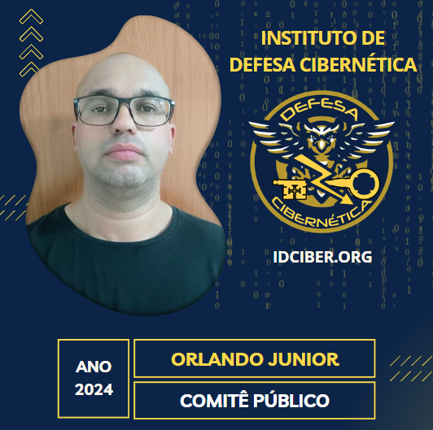

  
<!--  -->
<!--  -->
  

<!--  -->
  
<h3 align="center">
Python • SQL • Cloud computing AWS • Machine Learning • AI • Big Data • Modelagem de Dados • Pipeline de Dados - POO, ETL e Airflow
</h3>

  

  
  
   
  
  
  
  

  

 
  
## My Stack

## About me

-  Meu nome é Orlando Junior e atualmente sou estudante de Análise e Desenvolvimento de Sistemas na UNINASSAU, localizada em Campina Grande, Paraíba. Estou em uma fase de transição de carreira, buscando aprimorar minhas habilidades e conhecimentos em áreas específicas. 
-  Meu foco está voltado para a área de Data Science, e para alcançar meus objetivos, tenho me dedicado a aprender sobre Python, [Inteligência Artificial](https://catalog-education.oracle.com/pls/certview/sharebadge?id=61B339CA3932731E3F4D8B073264E65EEAB408BB3C8FB92235F82E9A5BD7F221#) e Estatística. Essas são ferramentas essenciais para explorar dados, criar modelos preditivos e extrair insights valiosos. Além disso, estou aproveitando as plataformas [ALURA](https://cursos.alura.com.br/user/orlandojsjunior) e [ADA](https://comunidade.ada.tech/) para aprofundar meus conhecimentos nessas áreas. 
-  Minhas principais hard skills: Python • SQL • Machine Learning • AI • Big Data • Data Visualization  
<!-- -  Sou muito família, amo esta em casa com minha esposa e filho, amo ser marido e pai.  
-  Quanto a minha experiência profissional, eu sou especialista em suporte e gerenciamento de infraestrutura de TI com mais de 17 anos de experiência. -->

<h3>Contact Me</h3>

<!-- 

<a href="mailto:orlandojsjunior@hotmamail.com">
 -->
  
</a>

  
Credits
 
  - GitHub Stats by <a href="https://github.com/anuraghazra/github-readme-stats">anuraghazra</a>
   
   - GitHub Streak by <a href="https://github.com/DenverCoder1/github-readme-streak-stats">DenverCoder1</a>
   
   - Skills on your GitHub - tandpfun <a href="https://github.com/tandpfun/skill-icons">Skill Icons</a>
   
  - Developer vector created by <a href="https://www.freepik.com/vectors/developer">storyset - www.freepik.com</a> (edited by author)

