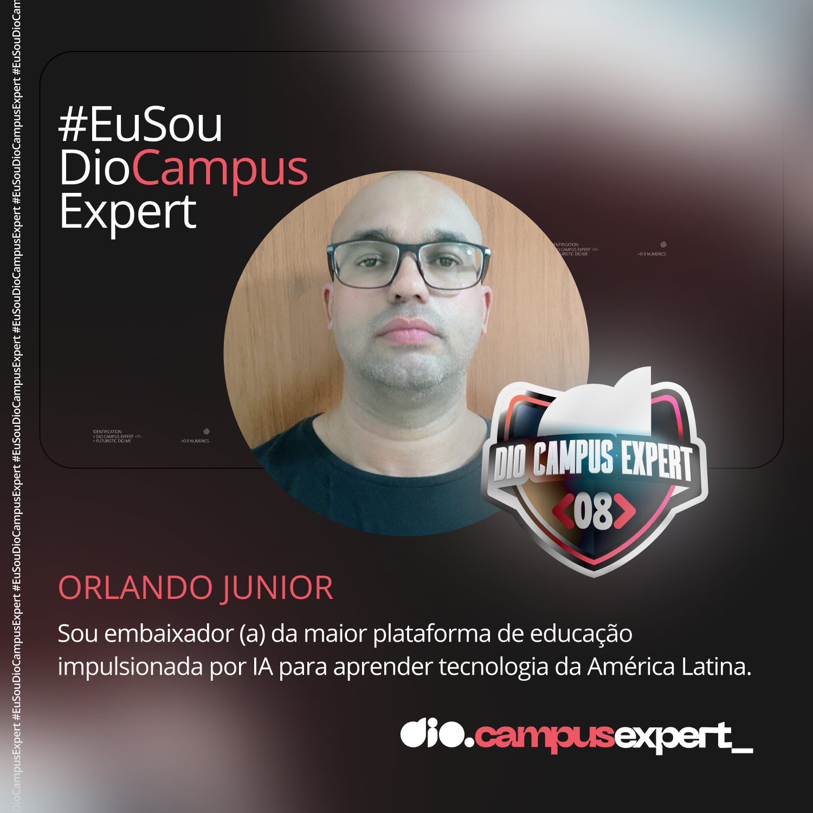

<!--  -->
  

<h3 align="center">
  Data Scientist em formação | Machine Learning | AI | Big Data | Python | SQL
</h3>

  
  
   
  
  
  

 

## &nbsp;My Stack

## About me

-  Olá! Meu nome é Orlando Junior, estudade de Análise e Desenvolvimento de Sistemas na [UNINASSAU - CAMPINA GRANDE - PB.](https://www.uninassau.edu.br/institucional/campina-grande).  
-  Meu objetivo atual é me tornar um Cientista de Dados, por isso tenho buscado conhecimento especifico em [PYTHON](https://www.python.org/) com foco em Data Science nas plataformas [ALURA](https://cursos.alura.com.br/user/orlandojsjunior) e [DIO](https://www.dio.me/users/orlandojsjunior) 
-  Principais hard skills:  Machine Learning | AI | Big Data | Python | SQL | Linguagen R | Tableau.  
-  I always try to be a polite and respectful person, and I love interacting with new people and sharing my story. 
-  I'm a Tech Instructor at @DIO_MAKETHECHANGE platform.

## 🎬 &nbsp;My Last Youtube Videos

<!-- YT LIST START -->

&nbsp;&nbsp;
**[▶️ Como CRIAR UM PROJETO C# no Visual Studio Code | C# DO JEITO MODERNO!](https://www.youtube.com/watch?v=JUF7M8hRbiM)**
  &nbsp;&nbsp;&nbsp;1 semana atrás

&nbsp;&nbsp;
**[▶️ COMO INSTALAR O DOTNET | C# DO JEITO MODERNO! ](https://www.youtube.com/watch?v=jcPpJ2tRe2g)**
  &nbsp;&nbsp;&nbsp;2 Semanas atrás

<!-- YT LIST END -->

learn dotnet c#? check out my channel [Veja meu Canal do Youtube.](https://www.youtube.com/@dotnetsenseidev)

<h3>Contact Me</h3>

  
Credits
 
  - GitHub Stats by <a href="https://github.com/anuraghazra/github-readme-stats">anuraghazra</a>
   
   - GitHub Streak by <a href="https://github.com/DenverCoder1/github-readme-streak-stats">DenverCoder1</a>
   
  - Developer vector created by <a href="https://www.freepik.com/vectors/developer">storyset - www.freepik.com</a> (edited by author)

